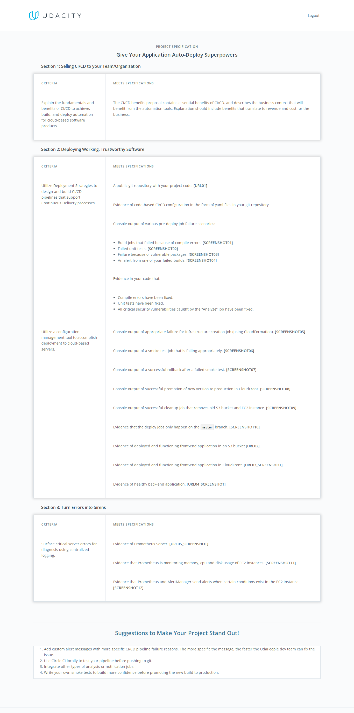

# ***This Is `Instructions` and `Starter Code` For Udapeople Project***

## Give your Application Auto-Deploy Superpowers

In this project, you will prove your mastery of the following learning objectives:

- Explain the fundamentals and benefits of CI/CD to achieve, build, and deploy automation for cloud-based software products.
- Utilize Deployment Strategies to design and build CI/CD pipelines that support Continuous Delivery processes.
- Utilize a configuration management tool to accomplish deployment to cloud-based servers.
- Surface critical server errors for diagnosis using centralized structured logging.

  

## Udapeople Pipeline  
<!--   -->
  
### Instructions

* [Selling CI/CD](instructions/0-selling-cicd.md)
* [Getting Started](instructions/1-getting-started.md)
* [Deploying Working, Trustworthy Software](instructions/2-deploying-trustworthy-code.md)
* [Configuration Management](instructions/3-configuration-management.md)
* [Turn Errors into Sirens](instructions/4-turn-errors-into-sirens.md)

### Project Submission

For your submission, please submit the following:

- A text file named `urls.txt` including:
  1. Public Url to GitHub repository (not private) [URL01]
  1. Public URL for your S3 Bucket (aka, your green candidate front-end) [URL02]
  1. Public URL for your CloudFront distribution (aka, your blue production front-end) [URL03]
  1. Public URLs to deployed application back-end in EC2 [URL04]
  1. Public URL to your Prometheus Server [URL05]
- Your screenshots in JPG or PNG format, named using the screenshot number listed in the instructions. These screenshots should be included in your code repository in the root folder.
  1. Job failed because of compile errors. [SCREENSHOT01]
  1. Job failed because of unit tests. [SCREENSHOT02]
  1. Job that failed because of vulnerable packages. [SCREENSHOT03]
  1. An alert from one of your failed builds. [SCREENSHOT04]
  1. Appropriate job failure for infrastructure creation. [SCREENSHOT05]
  1. Appropriate job failure for the smoke test job. [SCREENSHOT06]
  1. Successful rollback after a failed smoke test. [SCREENSHOT07]  
  1. Successful promotion job. [SCREENSHOT08]
  1. Successful cleanup job. [SCREENSHOT09]
  1. Only deploy on pushed to `master` branch. [SCREENSHOT10]
  1. Provide a screenshot of a graph of your EC2 instance including available memory, available disk space, and CPU usage. [SCREENSHOT11]
  1. Provide a screenshot of an alert that was sent by Prometheus. [SCREENSHOT12]

- Your presentation should be in PDF format named "presentation.pdf" and should be included in your code repository root folder. 

Before you submit your project, please check your work against the project rubric. If you haven’t satisfied each criterion in the rubric, then revise your work so that you have met all the requirements. 

## PROJECT SPECIFICATION  
   

### Built With  
- [Circle CI](www.circleci.com) - Cloud-based CI/CD service
- [Amazon AWS](https://aws.amazon.com/) - Cloud services
- [AWS CLI](https://aws.amazon.com/cli/) - Command-line tool for AWS
- [CloudFormation](https://aws.amazon.com/cloudformation/) - Infrastrcuture as code
- [Ansible](https://www.ansible.com/) - Configuration management tool
- [Prometheus](https://prometheus.io/) - Monitoring tool

## Get Start
### Prerequisites


* [GitHub account](https://github.com/)
  >intialize Git Repo  
  >Connect Local Git with remote GitHub  
  >Copy starter files from starter code  
  >create basic README.md  
  >commit and push changes  
  >create CircleCI project  
* [CircleCi account](https://circleci.com/)
  > We Will use convenience images provider by CircleCI  
  > For all jobs dependant on Node we will use: cimg/node:13.8.0  
  > We will use the built in caching to cache dependencies for faste execution time  
* [openSSH Client](https://docs.microsoft.com/en-us/windows-server/administration/openssh/openssh_install_firstuse)
  >openSSH is the premier connectivity tool for remote login with SSH protocol  
* [Docker](https://www.docker.com/)  
* [AWS account](https://aws.amazon.com/)  
* [kvdb api bucket](https://kvdb.io/)  
* [Slack api App](https://api.slack.com/)  
* Optional: 
    * [Nodejs 13](https://nodejs.org/en/) Node.js.13.8.0 and NPM6
      >Node.js is a JavaScript runtime built on Chrome's v8 JavaScript engine 
      * installation directly from Node.js installer . only one version per system
    * Using NVM if using multiple node versions
       >NPM is JavaScript Package Manger
       * Using Node version manager. NVM allow you to quickly install and use different versions of node via the command line
### Configuration Management Setup 
### Getting Start With AWS
* 1-from `EC2` Create and download a new `Key Pair` in AWS with this settings:
  * Name: `udacity`
  * key pair type: `RSA`
  * Private key file format:`pem`
   >download and Save `udacity.pem` file in your HD (*this is `SSH` Key*)

* 2-From `IAM` Create `User` and copy the `accesee key id` and `Secreat Access key` with this settings:
  * Name: `udapeople-circleci`
  * select AWS credentail type: `Access key-Programmatic Access`
  * set permissions > add user to group>attched policies: `AdminastorAccess`
   >Copy and Save `access ky id` and `secret access ky` at local file in your HD and download `SCV` File 
   
* 3-from `RDS` Create `PostgreSQL` database with this settings:
  * RDS>Create Database>
  * method: `standard create`
  * engine option: `PostgresSQL`
  * templates: `free tier`
  * settings> DB instance identifier :`udapeople-db`
  * settings> credantials setting> Master username:`PostgresSQL`
  * check `auto gen a password`
  * instance class : `db.t3.micro`
  * uncheck [] enable storage autoscaling
  * Connectivity > Public access : [`yes`]
  * Connectivity > additional configuration> Database port: `5432`
  * database authentication option: `password authentication`
  * additional configuration >database option> intial database name: `glee`
  * uncheck all other option check only `maintenance`
  * >Craete
  * save `master password` and `host` (*host is `Endpoint` url*) and `port` and must TCP port: `5432` is open for `0.0.0.0/0` ipv4 in `inbound` rules tab
* 4- from `S3` create public s3 `bucket` 
  > First, goto https://www.random.org/ website and start gen random strings you can get random strings like this:
  ```
  wqqrf71v
  j9bm5gmd
  0t3qo35c
  zrq890yb
  tdppifd8
  8odcrlsw
  rnfoquo0
  gnx8p0io
  ```
  > choose one of these random strings :`tdppifd8` to crate `bucket`
 * from AWS `s3` > craete a bucket with this settings:
 * bucket name: `udapeople-tdppifd8`
 * uncheck `[] block all public access`
 * check ` [x] I Knowledge that...`
 * >create
 * go to permissions tab>edit bucket policy> add this public access script :
 ```script
 {
    "Version": "2012-10-17",
    "Statement": [
        {
            "Sid": "PublicAccess",
            "Effect": "Allow",
            "Principal": "*",
            "Action": "s3:GetObject",
            "Resource": "arn:aws:s3:::udapeople-tdppifd8/*"
        }
    ]

 ```
* 5-run in VSCode Git Bash terminal This Command:
```bash
cd .circleci/files \
aws cloudformation deploy \
    --template-file cloudfront.yml \
    --stack-name InitialStack \
    --parameter-overrides WorkfllowID=tdppifd8
```
### Getting Start With CircleCI
first go to https://kvdb.io/ websit and make bucket  
1- add `ssh`key  
  >goto `project settings` : 
  >`SSH Key`>`Add SSH Key`> :
  >host name: `udapeopleKey`
  >private key: open `udacity.pem` select all and copy all and paste and press `add ssh key`
  >copy `fingerprint` and save it in your HD  

2- add the following environment variables to your CircleCI project by navigating to {project name}>settings>Environment Variables as shown here:  

`AWS_ACCESS_KEY_ID`=(from IAM user with programmatic access)  
`AWS_SECRET_ACCESS_KEY`=(from IAM user with programmatic access)  
`AWS_DEFAULT_REGION`=`us-east-1` (your default region in aws)  
`TYPEORM_CONNECTION`=`postgres`  
`TYPEORM_MIGRATIONS_DIR`=`./src/migrations`  
`TYPEORM_ENTITIES`=`./src/modules/domain/**/*.entity.ts`  
`TYPEORM_MIGRATIONS`=`./src/migrations/*.ts`  
`TYPEORM_HOST`={your postgres database hostname in RDS}  
`TYPEORM_PORT`=`5432` (or the port from RDS if it’s different)  
`TYPEORM_USERNAME`=`postgres`{your postgres database username in RDS}  
`TYPEORM_PASSWORD`={your postgres database password in RDS}  
`TYPEORM_DATABASE`=`postgres` {or your postgres database name in RDS}  
`KVDB_BUCKET`=(your Bucket name in https://kvdb.io websit)  


* [Prometheus](./instructions/Prometheus/README.md#what-is-prometheus)  
    * [OVERVIEW](./instructions/Prometheus/README.md#overview)  
    * [What is Prometheus?](./instructions/Prometheus/README.md#what-is-prometheus)  
    * [Features](./instructions/Prometheus/README.md#features)  
    * [Components](./instructions/Prometheus/README.md#components)  
    * [Architecture](./instructions/Prometheus/README.md#architecture)  
    * [When does it fit?](./instructions/Prometheus/README.md#when-does-it-fit)  

  * [1-Install Prometheus on AWS EC2](./instructions/Prometheus/1-install-prometheus-on-aws-ec2)   
  * [2-Prometheus Node Exporter on AWS EC2](./instructions/Prometheus/2-prometheus-node-exporter-on-aws-ec2)   
  * [3-Prometheus Discovery Service on AWS EC2](./instructions/Prometheus/3-prometheus-discovery-service-on-aws-ec2)   
  * [4-Prometheus Alertmanager Sending Emails](./instructions/Prometheus/4-prometheus-alertmanager-sending-emails)   
### License

[License](LICENSE.md)
