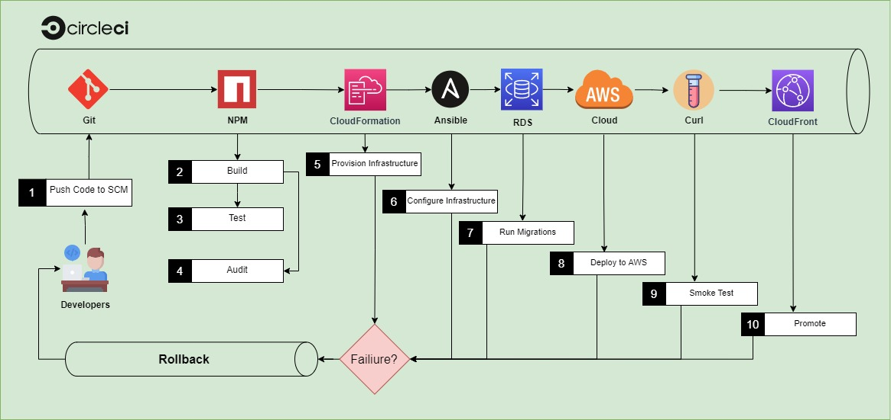

#
<h1 align="center">Udacity Advanced Cloud DevOps </h1>  

<!-- Adding Status Badges circleci Template
# Template:

# Example:

# Example for specific branch:

<PROJECT_NAME> - Your project’s name. Example: circleci-docs
<ORG_NAME> - The organization or user name the project in question belongs to
<VCS> - your VCS provider (gh for “github” and bb for BitBucket)
<LINK> - The link you want the status badge to go to when clicked (example: the pipeline overview page)
Optional: an API token (to create badges for private projects)
-->

<h3 align="center">Build CI/CD Pipelines, Monitoring & Logging Give Your Application Auto-Deploy Superpowers UdaPeople<i>(Cloud-Based Software)</i></h3>  
  

# 

 <a rel="Udacity" href="./2-udacity-passed.jpg">

## Table Of Contents
* [Udapeople](#udapeople)
* [Prerequisites](#prerequisites)
* [Built With](#built-with)
* [Section 1: Selling CI/CD to your Team/Organization](#section-1-selling-cicd-to-your-teamorganization)
* [ection 2: Deploying Working, Trustworthy Software](#section-2-deploying-working-trustworthy-software)
* [Section 3: Turn Errors into Sirens](#section-3-turn-errors-into-sirens)
* [Files Included](#files-included)
* [License](#license)

<h3 align="center">UdaPeople</h3>   

  

  A CI-CD pipeline for a client/server TypeScript project 
hosted on AWS EC2 and CloudFront and monitored with Prometheus, 
with Slack and E-mail notifications used for alerts. "<small><i>the fictional "UdaPeople" Product is  (Cloud-Based Software) Product,  a revolutionary concept in Human Resources which promises to help small businesses care better for their most valuable resource: their people."</i></small>

<h3 align="center">UdaPeople Pipeline</h3>   

  

## Prerequisites

 
 

* [Nodejs 13](https://nodejs.org/en/)
* [Docker](https://www.docker.com/)
* [GitHub account](https://github.com/)
* [CircleCi account](https://circleci.com/)
* [AWS account](https://aws.amazon.com/)
* [kvdb api bucket](https://kvdb.io/)
* [Slack api App](https://api.slack.com/)

## Built With

  
- [Circle CI](https://www.circleci.com) - Cloud-based CI/CD service
- [Amazon AWS](https://aws.amazon.com/) - Cloud services
- [AWS CLI](https://aws.amazon.com/cli/) - Command-line tool for AWS
- [CloudFormation](https://aws.amazon.com/cloudformation/) - Infrastrcuture as code
- [Ansible](https://www.ansible.com/) - Configuration management tool
- [Prometheus](https://prometheus.io/) - Monitoring tool
#
<h2 align="center">Project Submission</h2>  

  
    

<h3 align="center">Section 1: Selling CI/CD to your Team/Organization</h3>  

|CRITERIA|MEETS SPECIFICATIONS |Files |
|:-----|:-----|:-----|
|Explain the fundamentals and benefits of CI/CD to achieve, build, and deploy automation for cloud-based software products.|The CI/CD benefits proposal contains essential benefits of CI/CD, and describes the business context that will benefit from the automation tools. Explanation should include benefits that translate to revenue and cost for the business.|[presentation.pdf](./Presentation.pdf)|

<h3 align="center">Section 2: Deploying Working, Trustworthy Software</h3>  

|CRITERIA|MEETS SPECIFICATIONS |Files |
|:-----|:-----|:-----|
|Utilize Deployment Strategies to design and build CI/CD pipelines that support Continuous Delivery processes.|A public git repository with your project code. |[URL01](https://github.com/mohamedelfal/udapeople-cicd/) https://github.com/mohamedelfal/udapeople-cicd/| |
||Evidence of code-based CI/CD configuration in the form of yaml files in your git repository.|[config.yml](./.circleci/config.yml)|     |
||***Console output of various pre-deploy job failure scenarios:***||
||Build Jobs that failed because of compile errors. |[SCREENSHOT01](./screenshots/SCREENSHOT01.jpg)|
||Failed unit tests. |[SCREENSHOT02](./screenshots/SCREENSHOT02.jpg)|
||Failure because of vulnerable packages. |[SCREENSHOT03](./screenshots/SCREENSHOT03.jpg)|
||An alert from one of your failed builds. |[SCREENSHOT04](./screenshots/SCREENSHOT04.png) e-mail Notification [SCREENSHOT04](./screenshots/SCREENSHOT04.jpg) slack Notification |
||***Evidence in your code that:*** Compile errors have been fixed. Unit tests have been fixed. All critical security vulnerabilities caught by the “Analyze” job have been fixed|[.circleci](./.circleci) [backend](./backend) [frontend](./frontend)|
|Utilize a configuration management tool to accomplish deployment to cloud-based servers.|Console output of appropriate failure for infrastructure creation job (using CloudFormation). |[SCREENSHOT05](./screenshots/SCREENSHOT05.jpg)|
||Console output of a smoke test job that is failing appropriately. |[SCREENSHOT06](./screenshots/SCREENSHOT06.jpg)|
||Console output of a successful rollback after a failed smoke test. |[SCREENSHOT07](./screenshots/SCREENSHOT07.jpg)|
||Console output of successful promotion of new version to production in CloudFront. |[SCREENSHOT08](./screenshots/SCREENSHOT08.jpg)|
||Console output of successful cleanup job that removes old S3 bucket and EC2 instance. |[SCREENSHOT09](./screenshots/SCREENSHOT09.jpg)|
||Evidence that the deploy jobs only happen on the `master` branch. |[SCREENSHOT10](./screenshots/SCREENSHOT10.jpg)|
||Evidence of deployed and functioning front-end application in an S3 bucket .|[URL02] [URL02_SCREENSHOT](./screenshots/URL02_SCREENSHOT.jpg)|
||Evidence of deployed and functioning front-end application in CloudFront. |[URL03_SCREENSHOT](./screenshots/URL03_SCREENSHOT.jpg) [URL03-2_SCREENSHOT](./screenshots/URL03_SCREENSHOT-2.jpg) |
||Evidence of healthy back-end application. |[URL02] [URL04_SCREENSHOT](./screenshots/URL04_SCREENSHOT.jpg)|
<h3 align="center">Section 3: Turn Errors into Sirens</h3>  

|CRITERIA|MEETS SPECIFICATIONS |Files |
|:-----|:-----|:-----|
|Surface critical server errors for diagnosis using centralized logging.|Evidence of Prometheus Server. |[URL05] [URL05_SCREENSHOT](./screenshots/URL05_SCREENSHOT.jpg)|
||Evidence that Prometheus is monitoring memory, cpu and disk usage of EC2 instances. |[SCREENSHOT11 *CPU*](./screenshots/SCREENSHOT11_node_cpu_seconds_tota.jpg) [SCREENSHOT11 *Disk Usage*](./screenshots/SCREENSHOT11_node_filesystem_size_bytes.jpg) [SCREENSHOT11 *Memory*](./screenshots/SCREENSHOT11_node_memory_MemFree_bytes.jpg)|
||Evidence that Prometheus and AlertManager send alerts when certain conditions exist in the EC2 instance. |[SCREENSHOT12](./screenshots/SCREENSHOT12.jpg)|

## Files Included
* [.circleci](./.circleci)  
* [backend](./backend)
* [frontend](./frontend)  
* [util](./util)  
* [.gitignore](./.gitignore)  
* [Screenshots](./screenshots/)  
* [presentation.pdf](./Presentation.pdf)  
* [urls.txt](./urls.txt)    
* [README.md](./README.md)  
* [LICENSE.md](./LICENSE.md)  

## License  

<!-- small  This work is licensed under a <a rel="license" href="http://creativecommons.org/licenses/by-nc-nd/4.0/">Creative Commons Attribution-NonCommercial-NoDerivatives 4.0 International License</a>. -->

 # 

  This work is licensed under a <a rel="license" href="http://creativecommons.org/licenses/by-nc-nd/4.0/">Creative Commons Attribution-NonCommercial-NoDerivatives 4.0 International License</a>
 

 
<!--- big  This work is licensed under a <a rel="license" href="http://creativecommons.org/licenses/by-nc-nd/4.0/">Creative Commons Attribution-NonCommercial-NoDerivatives 4.0 International License</a>. -->
