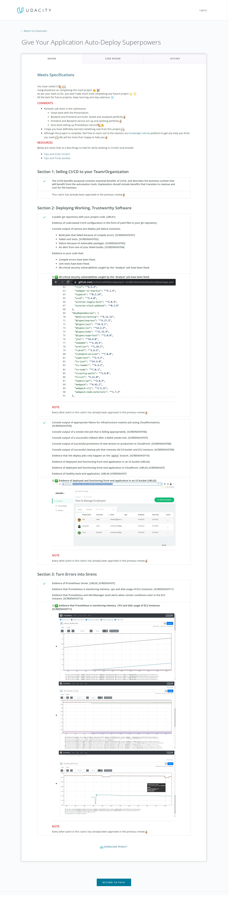

# 
# [Udacity cloud devops engineer](https://www.udacity.com/course/cloud-dev-ops-nanodegree--nd9991)

## Give Your Application Auto-Deploy Superpowers
## Project UdaPeople Passed
##   
## Review 1
* Requires Changes
* 3 specifications require changes

## Review 2
* Project Passed

